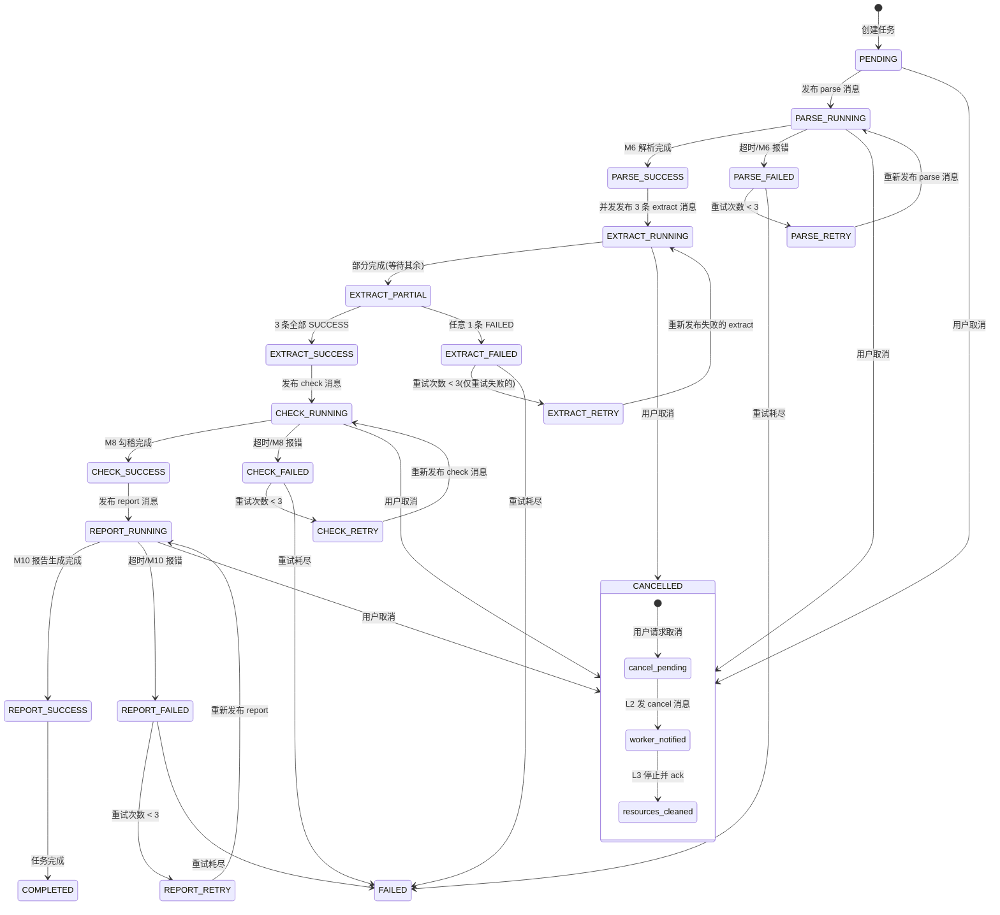

# FinReport Agent 设计文档

> **项目名称**：FinReport Agent — A 股上市公司财报深度解析 Agent
> **版本**：v1.0
> **日期**：2026-07-13
> **状态**：设计评审中

---

## 目录

- [0. 项目概述](#0-项目概述)
- [1. 整体架构与系统分层](#1-整体架构与系统分层)
- [2. 核心模块与组件](#2-核心模块与组件)
- [3. 数据流与处理链路](#3-数据流与处理链路)
- [4. Transformer 训练设计](#4-transformer-训练设计)
- [5. 数据层与存储设计](#5-数据层与存储设计)
- [6. 接口与交互设计](#6-接口与交互设计)
- [7. 异常处理 / 可观测性 / 测试与评估](#7-异常处理--可观测性--测试与评估)
- [8. 开发计划与里程碑](#8-开发计划与里程碑)

---

## 0. 项目概述

### 0.1 项目定位

金融垂直领域 - 智能投研助手 - **财报深度解析 Agent**。输入上市公司财报（PDF/HTML），输出结构化科目数据、勾稽核对结果、异常检测报告、自然语言分析报告，并支持基于财报内容的对话问答。

### 0.2 核心能力

1. **结构化科目数据**：资产负债表、利润表、现金流量表
2. **勾稽核对**：资产=负债+所有者权益等三大勾稽规则
3. **异常检测**：同比/环比异常、科目逻辑异常
4. **分析报告**：5 段式自然语言报告 + 图表
5. **对话问答**：基于财报内容的 ReAct + Tool Use 问答

### 0.3 约束与目标

| 维度 | 选择 |
|---|---|
| 领域 | 金融垂直领域 - 智能投研助手 |
| 核心 | 财报深度解析 Agent |
| GPU | RTX 4050 Mobile (6GB VRAM) |
| 形态 | 个人技术作品 Demo |
| 深度 | 全栈均衡型（解析+抽取+推理+生成） |

### 0.4 目标用户

个人投资者、券商研究员、金融学生。

### 0.5 技术栈概览

- **主后端**：Java 21 + SpringBoot 3.x + Spring WebFlux + Spring Security
- **AI 服务**：Python 3.11 + FastAPI + PyTorch 2.x
- **前端**：Vue3 + Element Plus + ECharts
- **消息队列**：RabbitMQ
- **存储**：MySQL 8.0 + Milvus 2.x + Redis 7 + MinIO
- **模型**：Qwen2.5-7B-Instruct（4-bit）/ Qwen2.5-1.5B（QLoRA）/ bge-small-zh（LoRA）/ LayoutLMv3
- **部署**：Docker Compose 单机

---

## 1. 整体架构与系统分层

### 1.1 分层架构

```
┌─────────────────────────────────────────────────────────────┐
│  L1 接入层  Vue3 + Element Plus + ECharts + SSE 客户端        │
│     · 财报上传 · 解析进度 · 对话问答 · 报告查看 · 异常标注      │
└────────────────────────┬────────────────────────────────────┘
                         │ REST + SSE (HTTP/2)
┌────────────────────────▼────────────────────────────────────┐
│  L2 应用层  SpringBoot 3.x + Spring WebFlux + Spring Security │
│     · 任务编排 · 会话管理 · SSE 转发 · 文件管理 · 审计日志      │
│     · 限流熔断 · 鉴权（JWT）· 参数校验                          │
└────────────────────────┬────────────────────────────────────┘
                         │ RabbitMQ + HTTP/SSE (内部)
┌────────────────────────▼────────────────────────────────────┐
│  L3 AI 服务层  Python 3.11 + FastAPI + PyTorch 2.x            │
│     · Document Parser · Extractor · Reasoner · Generator     │
│     · Agent Orchestrator（ReAct + Tool Use）                 │
│     · 模型加载/推理/向量化 · 训练入口（独立 CLI）              │
└────────────────────────┬────────────────────────────────────┘
                         │
┌────────────────────────▼────────────────────────────────────┐
│  L4 模型层                                                    │
│   · Qwen2.5-7B-Instruct (4-bit GPTQ)     — 主推理（本地）     │
│   · Qwen2.5-1.5B-Instruct (QLoRA 微调)   — 财报抽取专项       │
│   · bge-small-zh-v1.5 (LoRA 微调)        — 金融领域 embedding │
│   · LayoutLMv3 (微调)                    — 表格结构识别       │
│   · PaddleOCR / PP-StructureV2           — OCR 与版式（开箱）  │
│   · Qwen2.5-72B API（DeepSeek/Qwen）     — 兜底/复杂推理 fallback │
└────────────────────────┬────────────────────────────────────┘
                         │
┌────────────────────────▼────────────────────────────────────┐
│  L5 数据层                                                    │
│   · MySQL 8.0   财报元数据、科目数据、任务、用户、审计         │
│   · Milvus 2.x  向量库（财报段落/科目说明 chunk）             │
│   · Redis 7     会话缓存、任务队列、限流计数、模型推理缓存    │
│   · MinIO       原始 PDF / 解析中间产物 / 报告 PDF            │
│   · RabbitMQ    消息队列（任务下发 + 进度回报 + 问答 + KB）   │
└─────────────────────────────────────────────────────────────┘
```

### 1.2 关键架构决策

| 决策点 | 选择 | 理由 |
|---|---|---|
| 主后端语言 | Java/SpringBoot | 匹配技术栈强项；WebFlux 支持背压 SSE |
| AI 服务语言 | Python/FastAPI | PyTorch 生态、模型库完备 |
| Java-Python IPC | RabbitMQ + HTTP/SSE | MQ 解耦任务流；HTTP/SSE 传 token |
| LLM 推理后端 | llama.cpp / vLLM | 6GB VRAM 下 4-bit 7B 可跑（Offload CPU） |
| Agent 编排 | 自研轻量 ReAct 循环 | 避免黑盒依赖，便于展示架构深度 |
| 向量库 | Milvus（单机模式） | 成熟、支持 IVF/HNSW、可独立部署 |
| 消息队列 | RabbitMQ | 路由灵活、带管理界面、Demo 部署简单 |
| 部署 | Docker Compose | 单机一键起，符合个人 Demo |

### 1.3 部署拓扑

单机 Docker Compose，8 个 service：`frontend` / `backend` / `ai-service` / `mysql` / `redis` / `milvus` / `rabbitmq` / `minio`。模型权重通过 volume 挂载，避免镜像过大。

---

## 2. 核心模块与组件

### 2.1 模块全景

L2（Java）和 L3（Python）共 11 个核心模块：

```
L2 应用层 (Java/SpringBoot)
├── M1  接入网关        AuthController / GlobalExceptionHandler / RateLimiter
├── M2  任务编排        TaskOrchestrator（调用 AI 服务、汇总结果、写库）
├── M3  会话与SSE       SessionManager / SseEmitter 池 / 背压控制
├── M4  文件与产物      FileService（MinIO 上传/下载、PDF 预签名 URL）
└── M5  审计与配置      AuditLogger / ConfigService / 模型路由配置

L3 AI 服务层 (Python/FastAPI)
├── M6  文档解析        DocumentParser（PDF→页面/版式/表格/段落）
├── M7  科目抽取        Extractor（科目名/数值/单位/期间/合并/母公司）
├── M8  勾稽与异常      Reasoner（勾稽核对、同比环比、异常规则）
├── M9  Agent 编排      AgentOrchestrator（ReAct 循环 + Tool Use）
├── M10 报告生成        ReportGenerator（NLG + 图表 + Markdown→PDF）
└── M11 模型与训练      ModelHub（推理/向量化） + Trainer（QLoRA/LoRA CLI）
```

### 2.2 L2 应用层模块

#### M1 接入网关
- `AuthController`：JWT 登录/注册，签发 1h access token + 7d refresh token
- `GlobalExceptionHandler`：统一 RFC 9457 Problem Details 错误响应
- `RateLimiter`：基于 Redis 令牌桶，按用户/IP 限流（默认 10 req/s）

#### M2 任务编排
- `TaskOrchestrator`：把"解析一份财报"拆为 6 个原子任务：
  1. `PARSE` → M6
  2. `EXTRACT_BS / EXTRACT_IS / EXTRACT_CF` → M7（三表并行）
  3. `CHECK` → M8
  4. `REPORT` → M10
- 每步状态写 MySQL，SSE 推进度
- 失败重试：指数退避，最多 3 次；失败超阈值标记任务为 FAILED

#### M3 会话与 SSE
- `SessionManager`：管理用户对话上下文，Redis 存最近 10 轮
- `SseEmitterPool`：维持长连接，按 `taskId` 路由消息；客户端断连后自动清理
- 背压：WebFlux `Flux.onBackpressureBuffer(64)`，溢出丢弃最旧

#### M4 文件与产物
- `FileService`：MinIO 客户端，PDF 上传分片（5MB/chunk）；预签名 URL 有效期 15 分钟
- 中间产物（页面图像、表格 JSON、抽取结果）按 `taskId/{step}/` 目录组织

#### M5 审计与配置
- `AuditLogger`：所有写操作落 `audit_log` 表
- `ConfigService`：模型路由配置，可热切换"本地 7B / API 72B / 抽取小模型"

### 2.3 L3 AI 服务层模块

#### M6 文档解析（DocumentParser）
- **PDF→页面**：PyMuPDF 提取文本+图像（DPI=200）
- **版式分析**：PP-StructureV2 识别标题/正文/表格/页眉页脚
- **表格识别**：LayoutLMv3 微调模型 + PP-Structure 表格还原（HTML）
- **OCR 兜底**：扫描件走 PaddleOCR
- 输出：`Document` 对象 = `[Page{blocks:[TextBlock, TableBlock]}]`

#### M7 科目抽取（Extractor）
- **输入**：三张表的 TableBlock（HTML/JSON）
- **模型**：Qwen2.5-1.5B QLoRA 微调（财报抽取专项）
- **Schema 输出**（JSON，强约束）：
  ```json
  {
    "report_period": "2024-12-31",
    "currency": "CNY",
    "unit": "元",
    "statements": {
      "balance_sheet": [
        {"item": "货币资金", "value": 1234567890.00, "scope": "合并", "period": "本期"}
      ]
    }
  }
  ```
- **校验**：JSON Schema 校验 + 数值合法性（非 NaN、单位一致）

#### M8 勾稽与异常（Reasoner）
- **勾稽规则**（硬编码 + LLM 复核）：
  - 资产 = 负债 + 所有者权益
  - 净利润 → 未分配利润变动（含分红调整）
  - 经营活动现金流净额 vs 净利润差异（含折旧摊销调整）
- **异常检测**：
  - 同比/环比变动 > 阈值（默认 30%）
  - 科目逻辑异常（如应收账款激增但营收下滑）
- **输出**：`CheckResult{rules:[], anomalies:[], confidence:0.0-1.0}`

#### M9 Agent 编排（AgentOrchestrator）
- **ReAct 循环**：`Thought → Action → Observation → Thought... → Final Answer`
- **工具集**（注册到 ToolRegistry）：

  | 工具 | 入参 | 出参 |
  |---|---|---|
  | `query_statement` | 科目名, 期间, 报表类型 | 数值 |
  | `compute_yoy` | 科目名 | 同比 % |
  | `compute_qoq` | 科目名 | 环比 % |
  | `check_accounting` | 无 | 勾稽结果 |
  | `search_kb` | 关键词 | 相关段落 |
  | `unit_convert` | 数值, 源单位, 目标单位 | 转换后数值 |

- **终止条件**：达到 Final / 步数上限 8 / Tool 报错 3 次

#### M10 报告生成（ReportGenerator）
- **NLG**：基于抽取结果 + 异常 + 检索段落，调用 LLM 生成 5 段式报告：
  1. 公司概况 2. 财务概览 3. 三表分析 4. 异常与风险 5. 结论
- **图表**：ECharts 服务端渲染为 PNG（资产结构饼图、营收趋势折线、现金流柱状）
- **导出**：Markdown → PDF（WeasyPrint）

#### M11 模型与训练（ModelHub + Trainer）
- **ModelHub**：统一模型加载/推理入口，支持本地 + API 双通道
  - `load_llm(name, quant)` / `generate(prompt, **kwargs)` / `embed(texts)`
  - LRU 模型缓存（按显存预算调度，6GB 一次只装一个 7B + 一个 small）
- **Trainer**：独立 CLI（`finreport-train`），三个子命令：
  - `train-extractor` — Qwen2.5-1.5B QLoRA
  - `train-embedder` — bge-small-zh LoRA
  - `train-layoutlm` — LayoutLMv3 微调
  - 训练数据从 MySQL/MinIO 加载，产出 LoRA adapter 存 `models/`

### 2.4 模块依赖关系

```
M1 ─ M2 ─┬─ M6 ─ M7 ─ M8 ─ M9 ─ M10
         │              │
         ├─ M3 (SSE)    └─ M11 (推理)
         ├─ M4 (文件)
         └─ M5 (审计)
```

数据顺序：上传 → M2 编排 → M6 解析 → M7 抽取（并行三表） → M8 勾稽 → M9 推理（按需，对话时触发）→ M10 生成报告。M9 在"上传财报"链路里可选触发，在"对话问答"链路里是主入口。

### 2.5 关键设计原则

1. **模块隔离**：每个 L3 模块独立 FastAPI router，单独可测、可单独重启
2. **模型与业务解耦**：所有模型调用走 M11 ModelHub，业务层不直接 import transformers
3. **失败可降级**：本地 7B 失败 → API 72B；抽取小模型失败 → 7B 兜底
4. **配置驱动**：模型路由、阈值、工具开关全部走 M5 配置中心

---

## 3. 数据流与处理链路

### 3.1 消息队列拓扑

RabbitMQ 用 4 类 exchange + 6 个核心队列：

```
                    ┌──────────────────────────┐
                    │  task.exchange (direct)  │  L2 → L3 任务下发
                    └────────┬─────────────────┘
                             │ routing_key
        ┌────────────────────┼────────────────────┐
        ▼                    ▼                    ▼
  q.parse.requests     q.extract.requests   q.reason.requests
  (M6 消费)            (M7 消费)            (M8/M10 消费)

                    ┌──────────────────────────┐
                    │  progress.exchange(fanout)│  L3 → L2 进度回报
                    └────────┬─────────────────┘
                             │
                             ▼
                       q.progress.results (L2 消费，按 taskId 路由到 SSE)

                    ┌──────────────────────────┐
                    │  chat.exchange (direct)  │  L2 → L3 问答请求
                    └────────┬─────────────────┘
                             ▼
                       q.chat.requests (M9 消费)

                    ┌──────────────────────────┐
                    │  kb.exchange (topic)     │  离线知识库构建
                    └────────┬─────────────────┘
                             ▼
                       q.kb.build (M6/M11 消费)
```

| Exchange | 类型 | 路由键示例 | 生产者 | 消费者 |
|---|---|---|---|---|
| `task.exchange` | direct | `parse`, `extract.bs`, `extract.is`, `extract.cf`, `check`, `report` | L2 TaskOrchestrator | L3 各模块 |
| `progress.exchange` | fanout | （广播） | L3 各模块 | L2 ProgressConsumer |
| `chat.exchange` | direct | `chat` | L2 | L3 M9 |
| `kb.exchange` | topic | `kb.build.report`, `kb.build.industry` | 离线脚本 | L3 |

**可靠性配置**：
- 所有队列 `durable=true`，消息 `delivery_mode=2`（持久化）
- 消费者 `prefetch_count=1`（按显存容量限流）
- 手动 ack：业务处理成功才 ack；失败 nack + requeue=false → 进死信队列 `q.{name}.dlq`
- 死信队列有独立监控告警（消费失败日志）

### 3.2 链路 A：财报解析主链路（MQ 驱动）

```
[前端]              [L2 Java]              [RabbitMQ]            [L3 Python]          [数据层]
  │ 1.POST upload      │                       │                     │                  │
  │───────────────────▶│                       │                     │                  │
  │                    │ 2.存 MinIO+建 task    │                     │                  │
  │                    │────────────────────────────────────────────────────────────▶│
  │ 3.return taskId    │                       │                     │                  │
  │◀───────────────────│                       │                     │                  │
  │ 4.GET /tasks/{id}/stream (SSE)             │                     │                  │
  │───────────────────▶│                       │                     │                  │
  │                    │ 5.发布 parse 消息      │                     │                  │
  │                    │──────────────────────▶│                     │                  │
  │                    │                       │ 6.投递 q.parse      │                  │
  │                    │                       │────────────────────▶│                  │
  │                    │                       │                     │ 7.M6 解析        │
  │                    │                       │                     │   → Document    │
  │                    │                       │                     │─────────────────▶│ (MinIO)
  │                    │                       │                     │ 8.ack + 发布进度 │
  │                    │                       │◀────────────────────│ progress: PARSE  │
  │                    │ 9.消费 progress        │                     │                  │
  │                    │   按 taskId 路由 SSE   │                     │                  │
  │ 10.SSE: PARSE ok   │                       │                     │                  │
  │◀───────────────────│                       │                     │                  │
  │                    │ 11.并发发布 3 条 extract 消息                 │                  │
  │                    │──────────────────────▶│                     │                  │
  │                    │                       │ 12.投递 3 个 q.extract                 │
  │                    │                       │────────────────────▶│ (3 worker 并行) │
  │                    │                       │                     │ 13.M7 抽取三表  │
  │                    │                       │                     │   → Statement   │
  │                    │                       │                     │─────────────────▶│ (MySQL)
  │                    │                       │◀────────────────────│ progress×3       │
  │ 14.SSE: EXTRACT×3  │                       │                     │                  │
  │◀───────────────────│                       │                     │                  │
  │                    │ 15.三表都 ok 后发布 check 消息                │                  │
  │                    │──────────────────────▶│                     │
  │                    │                       │────────────────────▶│ 16.M8 勾稽       │
  │                    │                       │◀────────────────────│ progress: CHECK  │
  │ 17.SSE: CHECK      │                       │                     │                  │
  │◀───────────────────│                       │                     │                  │
  │                    │ 18.发布 report 消息    │                     │                  │
  │                    │──────────────────────▶│                     │                  │
  │                    │                       │────────────────────▶│ 19.M10 生成     │
  │                    │                       │                     │   → PDF + Markdown
  │                    │                       │                     │─────────────────▶│ (MinIO)
  │                    │                       │◀────────────────────│ progress: REPORT │
  │ 20.SSE: REPORT ok  │                       │                     │                  │
  │  + reportUrl       │                       │                     │                  │
  │◀───────────────────│                       │                     │                  │
```

**关键设计**：
- L2 不再直接 HTTP 调 L3，而是发布消息；L3 处理完后通过 `progress.exchange` 异步回报
- 三表并行天然实现：3 条 `extract.*` 消息由 3 个独立 worker 消费（prefetch=1 防显存抢占）
- L2 用 `ConcurrentNavigableMap<taskId, SseEmitter>` 维护活跃 SSE 连接，收到 progress 消息时按 `taskId` 路由
- **任务编排从"同步等"变成"事件驱动"**：L2 监听 progress 事件，在 EXTRACT 三条都到达后自动触发 CHECK（用 `AtomicInteger` 计数 + Redis 状态机）

#### 3.2.1 任务状态机（完整定义）



**状态转换规则**：

| 转换 | 条件 |
|---|---|
| *_RUNNING → *_RETRY | MQ 消息 nack(requeue=true)，重试次数 < 3 |
| *_RETRY → *_RUNNING | 指数退避后重新投递（1s → 2s → 4s） |
| *_FAILED → FAILED | 重试次数 >= 3 + 降级也失败 |
| 任意状态 → CANCELLED | L2 通过 Redis `fin:cancel:{taskId}` 发布取消信号，L3 worker 轮询检测 |
| CANCELLED 后 | 已写入数据保留不清除，task.status=CANCELLED |

**EXTRACT 三表并行的特殊规则**：

- 3 条 extract 消息（bs/is/cf）各自独立状态，但对外暴露为 EXTRACT 聚合状态
- BS/IS/CF 各有一条独立的 EXTRACT_FAILED → EXTRACT_RETRY 路径
- 只有 3 条全部 SUCCESS 才进入 CHECK
- 任意 1 条 final FAILED → 整任务 FAILED
- 已成功抽取的表（如 BS）的数据已写入 `financial_statement`，不做回滚（保留供排查）

**超时与补偿**：

- L2 `ScheduledExecutor` 每 30s 检查 RUNNING 状态超过 2×SLA 的任务
- 超时未收到 progress → 通过 Redis `fin:task:heartbeat:{taskId}` 检查 L3 是否存活
- L3 无心跳 → 发补偿消息查询；仍无响应 → 标记 FAILED
- MQ 消息投递后 10s 未 confirm → 写入 `outbox` 表 → 后台补偿重投

### 3.3 链路 B：问答对话链路（MQ + 流式混合）

问答链路需要**流式 token**，纯 MQ 不适合传 token。采用**混合模式**：

- **控制流走 MQ**：L2 发 chat 消息 → M9 消费 → M9 完成后通过 progress.exchange 回报"chat_done"
- **数据流走 SSE 长连接**：M9 推理时直接 HTTP chunked 把 token 推回 L2 的内部 SSE 端点，L2 透传前端

```
[前端]              [L2 Java]              [RabbitMQ]            [L3 M9]
  │ 1.POST /chat        │                       │                     │
  │───────────────────▶│                       │                     │
  │                    │ 2.发布 chat 消息       │                     │
  │                    │   + 内部 SSE 端点 token│                     │
  │                    │──────────────────────▶│                     │
  │                    │                       │────────────────────▶│
  │                    │                       │                     │ 3.M9 起 ReAct
  │                    │                       │                     │   tool 调用走
  │                    │                       │                     │   同进程函数
  │                    │ 4.建立内部 SSE 拉流    │                     │
  │                    │◀─────────────────────────────────────────────│ chunked token
  │ 5.SSE 透传 token    │                       │                     │
  │◀───────────────────│                       │                     │
  │                    │                       │                     │ 6.M9 完成
  │                    │                       │◀────────────────────│ progress: chat_done
  │                    │ 7.消费 chat_done       │                     │
  │                    │   关闭 SSE            │                     │
  │ 8.SSE: [DONE]      │                       │                     │
  │◀───────────────────│                       │                     │
```

**为什么这样**：
- 控制面（任务生命周期、失败重试、状态机）走 MQ，可靠
- 数据面（token 流）走 HTTP chunked，低延迟
- M9 工具调用（query_statement 等）是**同进程函数调用**，不走 MQ

### 3.4 链路 C：知识库构建（离线，批处理）

```
[原始 PDF/HTML]
       │
       ▼
[批处理脚本 scripts/build_kb.py]
       │ 1.遍历 data/raw_reports/
       │ 2.调用 M6 DocumentParser 解析
       │ 3.按段落 + 表格行切块（chunk_size=512, overlap=64）
       │ 4.调用 M11 ModelHub.embed()  (bge-small-zh LoRA)
       │ 5.写 Milvus collection: fin_kb
       │ 6.写 MySQL: kb_chunks 元数据
       ▼
[Milvus: fin_kb (HNSW, dim=512)]
[MySQL: kb_chunks (chunk_id, doc_id, text, page, position)]
```

**调度**：手动触发 + 每周定时（cron）增量更新。Demo 阶段预置 50-100 份 A 股年报即可。

### 3.5 辅助链路 D：模型推理路由

```
[业务请求] → ModelHub.route(scene)
                │
                ├── scene=EXTRACT → Qwen2.5-1.5B QLoRA (本地, 4-bit)
                ├── scene=REASON  → Qwen2.5-7B-Instruct (本地, 4-bit GPTQ)
                ├── scene=REASON_FALLBACK → Qwen2.5-72B API
                ├── scene=EMBED   → bge-small-zh LoRA (本地)
                └── scene=LAYOUT  → LayoutLMv3 (本地)
```

**显存调度**：6GB VRAM 单次只能装 1 个 7B(4bit~5GB) 或 1 个 1.5B + 1 个 small。ModelHub 维护 `model_lock`，按需 unload/load，LRU 策略。频繁切换会拖慢响应，所以：
- EXTRACT 链路里**只**用 1.5B（不切 7B）
- REASON 链路里**只**用 7B（不切 1.5B）
- 通过任务编排避免显存抖动

### 3.6 辅助链路 E：训练数据回流（闭环，可选）

```
[用户问答] → [日志] → [人工标注界面(简易)] → [训练集] → [Trainer 增量微调]
```

Demo 阶段做最简版：所有问答 + 抽取结果落 `train_log` 表，提供 SQL 导出脚本，方便后续增量训练。不做自动闭环。

### 3.7 关键时序约束（SLA）

| 链路 | 阶段 | SLA 目标 | 超时 |
|---|---|---|---|
| A | PARSE (100页 PDF) | < 90s | 180s |
| A | EXTRACT (三表并行) | < 60s | 120s |
| A | CHECK | < 30s | 60s |
| A | REPORT | < 45s | 90s |
| A | **总链路** | **< 4min** | 8min |
| B | 单轮问答 | < 15s 首 token，< 30s 完整 | 60s |
| C | 单份入库 | < 2min | 5min |

### 3.8 失败与降级（MQ 特有）

| 场景 | 处理 |
|---|---|
| 消息处理异常 | nack(requeue=false) → 进 `q.{name}.dlq`；L2 监听 dlq 推送 SSE error |
| 消费者宕机 | RabbitMQ 自动重新投递给其他 worker；无 worker 时消息堆积（监控告警） |
| L2 发布后超时未收 progress | L2 用 `ScheduledExecutor` 检查 task 状态，超 2×SLA 仍未完成则发补偿消息查询 L3，再不行标记 FAILED |
| 重复消费 | 消息体带 `idempotency_key = taskId + step`，L3 用 Redis SETNX 去重；重试次数通过消息属性 `headers.x-retry-count` 传递 |
| 消息乱序 | 同一 taskId 的 step 用 RabbitMQ 的 `priority` 字段 + L2 状态机校验 |

### 3.9 显存调度（MQ 视角）

- `q.parse.requests`、`q.extract.requests`、`q.reason.requests` 的 consumer 各自 `prefetch=1`
- 但**全局只能有 1 个 7B 或 1 个 1.5B+small 在显存里**
- L3 用一个**全局 model_lock**（Redis 分布式锁）：消费消息前先获取对应模型的 lock，拿不到就 nack(requeue=true, delay=2s)
- 这样多 worker 进程不会同时加载冲突模型

### 3.10 并发与一致性

- **任务并发**：单用户最多 1 个解析任务在跑（防 6GB 显存被打爆）；问答不限
- **数据一致性**：财报解析期间所有写入走同一个 `taskId` 事务边界，失败时 `task` 标记 FAILED，关联数据保留（用于排查），不强制回滚
- **缓存**：抽取结果按 `pdf_md5 + step` 缓存到 Redis（TTL 7d），重传同文件直接命中

---

## 4. Transformer 训练设计

### 4.1 训练任务总览

| 编号 | 任务 | 基座 | 方法 | 数据量 | 显存峰值 | 预计耗时 |
|---|---|---|---|---|---|---|
| T1 | 财报科目抽取专项 | Qwen2.5-1.5B-Instruct | QLoRA (4-bit) + LoRA (r=16) | 5k 样本 | ~5.2 GB | ~3 h (3 epoch) |
| T2 | 金融领域 embedding | bge-small-zh-v1.5 | LoRA (r=8) + 对比学习 | 20k 正负对 | ~3.8 GB | ~2 h |
| T3 | 财报表格结构识别 | LayoutLMv3-base | 全参微调（frozen backbone + 头部训练） | 2k 表格图 | ~4.5 GB | ~4 h |

**总训练时长约 9 小时**，6GB VRAM 下分批跑完全可行。

### 4.2 T1：财报科目抽取专项模型

#### 4.2.1 目标
让 1.5B 小模型在"财报表格 → 结构化 JSON"任务上接近甚至超过 7B 通用模型，节省显存。

#### 4.2.2 训练数据
- **来源**：
  1. 巨潮资讯网（cninfo）爬取 A 股年报 PDF（覆盖 10 个行业 × 5 家公司 × 3 年 = 150 份）
  2. 用 PP-Structure + 人工校对生成三表 ground truth JSON
  3. 数据增强：同义科目名替换（"货币资金" ↔ "现金及银行存款"）、单位换算、行序打乱
- **格式**（ChatML 多轮）：
  ```
  <|im_start|>system
  你是财报抽取助手，输出严格 JSON。
  <|im_end|>
  <|im_start|>user
  抽取以下表格的科目数据：
  [表格 HTML]
  <|im_end|>
  <|im_start|>assistant
  {"report_period":"2024-12-31","statements":{"balance_sheet":[...]}}
  <|im_end|>
  ```
- **切分**：训练 4500 / 验证 300 / 测试 200

#### 4.2.3 训练配置
```python
# 关键超参（PEFT + bitsandbytes）
base_model: Qwen2.5-1.5B-Instruct
load_in_4bit: True
bnb_4bit_quant_type: nf4
bnb_4bit_compute_dtype: bfloat16
lora_r: 16
lora_alpha: 32
lora_target_modules: [q_proj, k_proj, v_proj, o_proj, gate_proj, up_proj, down_proj]
lora_dropout: 0.05
learning_rate: 2e-4
batch_size: 1
gradient_accumulation_steps: 16  # 等效 batch=16
max_seq_length: 2048
warmup_ratio: 0.03
lr_scheduler_type: cosine
num_train_epochs: 3
optimizer: paged_adamw_8bit  # 8bit 优化器，省显存
gradient_checkpointing: True
```

#### 4.2.4 显存预算（6GB）
| 项 | 占用 |
|---|---|
| 1.5B 4-bit 权重 | ~1.0 GB |
| LoRA 参数 | ~30 MB |
| 激活值（seq=2048, grad_ckpt） | ~2.5 GB |
| 8bit 优化器状态 | ~0.6 GB |
| 中间张量 + PyTorch 缓存 | ~1.0 GB |
| **合计** | **~5.1 GB** ✅ |

#### 4.2.5 评估指标
- **JSON 解析率**：输出能解析为合法 JSON 的比例（目标 > 95%）
- **字段 F1**：科目名/数值/单位/期间四字段的 F1（目标 > 0.85）
- **数值准确率**：数值完全一致的比例（目标 > 0.90）
- **对比基线**：vs 未微调 Qwen2.5-1.5B、vs Qwen2.5-7B-Instruct 通用 prompt

### 4.3 T2：金融领域 embedding 微调

#### 4.3.1 目标
通用 bge-small-zh 在金融术语（如"商誉减值"、"递延所得税资产"、"经营活动产生的现金流量净额"）上召回率偏低。微调后提升 `search_kb` 在金融语料上的检索质量。

#### 4.3.2 训练数据
- **正样本对**：
  1. 同一科目不同表述（"应收账款" ↔ "应收帐款" ↔ "Trade receivables"）
  2. 财报段落 ↔ 其摘要
  3. 用户问题 ↔ 对应财报段落（基于历史问答日志构造）
- **负样本**：同 batch 内其他段落 + 困难负例（同行业不同公司）
- **规模**：20k 正对 + 60k 负例（InfoNCE 内 batch 构造）
- **格式**：`(query, positive, [negatives])` 三元组

#### 4.3.3 训练配置
```python
base_model: BAAI/bge-small-zh-v1.5  # 33M 参数, 512 dim
method: LoRA (r=8, alpha=16, target: query, key, value)
loss: InfoNCE (in-batch negatives + hard negatives)
temperature: 0.02
learning_rate: 5e-5
batch_size: 32  # 33M 模型显存压力小
max_seq_length: 256
num_train_epochs: 5
```

#### 4.3.4 评估指标
- **MRR@10**：在 200 条金融检索 query 上的平均倒数排名（目标 > 0.78）
- **Recall@5**：前 5 命中率（目标 > 0.85）
- **对比基线**：vs 原版 bge-small-zh、vs bge-large-zh（未微调）

### 4.4 T3：财报表格结构识别

#### 4.4.1 目标
通用 PP-Structure 对复杂财报表格（合并单元格、跨页、多级表头）识别准确率不够。微调 LayoutLMv3 提升 cell 检测与结构还原。

#### 4.4.2 任务拆分
LayoutLMv3 在本项目中做 **2 个子任务**：
1. **Cell Detection**：检测表格单元格 bbox（Token + Layout → bbox）
2. **Cell Classification**：分类单元格角色（表头/数据/合计行/单位行）

#### 4.4.3 训练数据
- **来源**：从 T1 的 150 份年报中标注 2000 个表格（用 Label Studio）
- **增强**：旋转 ±5°、加噪、压缩、变色
- **格式**：每张表格图 = 图像 + 单词 bbox 列表 + 单词 token + 单元格分组标签

#### 4.4.4 训练配置
```python
base_model: microsoft/layoutlmv3-base
# 冻结 backbone 80%, 只微调后 4 层 + 分类头
freeze_layers: 0..8  # 共 12 层, 冻结前 8 层
trainable: encoder.layer.{8,9,10,11} + head
method: 全参微调 (frozen backbone 部分)
learning_rate: 5e-5  # backbone 微调部分
head_lr: 1e-4  # 头部
batch_size: 2
gradient_accumulation_steps: 8
max_steps: 5000
image_size: 224
```

#### 4.4.5 显存预算
| 项 | 占用 |
|---|---|
| LayoutLMv3-base (135M, fp16) | ~0.27 GB |
| 可训练参数 (后4层+头, ~30M) | ~60 MB |
| 激活值 (bs=2, 224×224, seq=512) | ~3.2 GB |
| 优化器状态 (AdamW) | ~0.7 GB |
| 其他 | ~0.3 GB |
| **合计** | **~4.5 GB** ✅ |

#### 4.4.6 评估指标
- **Cell mAP@0.5**：单元格检测平均精度（目标 > 0.88）
- **Cell 角色分类 F1**（目标 > 0.85）
- **端到端表格还原 TEDS**（目标 > 0.82）

### 4.5 训练流水线架构

```
┌─────────────────────────────────────────────────────────┐
│  scripts/finreport-train (CLI)                          │
│   ├── train-extractor  (T1)                             │
│   ├── train-embedder   (T2)                             │
│   └── train-layoutlm   (T3)                             │
└────────────────────────┬────────────────────────────────┘
                         │
        ┌────────────────┼────────────────┐
        ▼                ▼                ▼
   [数据加载层]      [训练引擎]        [评估层]
   MySQL/MinIO      PEFT+Transformers  metrics.py
   → Dataset        +bitsandbytes       +对比基线
   → DataLoader     +accelerate
                         │
                         ▼
              [产物: LoRA adapter]
              models/{task}/adapter_{step}/
                         │
                         ▼
              [自动评估 + 选最佳]
              models/{task}/best/
                         │
                         ▼
              [注册到 ModelHub]
              MySQL: model_registry 表
```

### 4.6 训练数据管理

| 数据集 | 存储 | 标注工具 | 标注量 |
|---|---|---|---|
| T1 抽取数据 | MinIO `data/training/extractor/` | 自研 Web 标注页（Vue） | 5k 样本 |
| T2 embedding 对 | MySQL `train_pairs` 表 | 脚本自动生成 + 人工抽检 | 20k 对 |
| T3 表格标注 | MinIO `data/training/layoutlm/` | Label Studio | 2k 表格 |

**数据版本化**：用 DVC（Data Version Control）跟踪数据集版本，与 LoRA adapter 版本绑定，可复现。

### 4.7 模型注册与版本管理

MySQL `model_registry` 表：

| 字段 | 说明 |
|---|---|
| id | 主键 |
| task | extractor / embedder / layoutlm |
| base_model | 基座名 |
| adapter_path | MinIO 路径 |
| version | v1.0.0 (语义化) |
| metrics | JSON（评估指标） |
| trained_at | 训练时间 |
| status | candidate / staged / production / archived |
| trained_by | 训练命令 hash + 数据集版本 |

ModelHub 启动时加载 `status=production` 的 adapter；新版本训练完先 `candidate`，A/B 评估通过后手动 `staged → production`。

### 4.8 训练监控

- **过程指标**：TensorBoard / WandB 记录 loss / lr / grad_norm
- **资源监控**：每 10s 采一次 GPU 利用率、显存占用、温度（防笔记本过热降频）
- **训练时长保护**：单次训练超 8h 自动 checkpoint + 暂停

### 4.9 6GB VRAM 训练避坑清单

| 坑 | 对策 |
|---|---|
| OOM | gradient_checkpointing + paged_adamw_8bit + 4-bit 量化 |
| 训练慢 | 1.5B 模型 3 epoch 约 3h，可接受；用 accelerate 启用混合精度 |
| 过拟合 | LoRA r 控制在 8-16；验证集 loss 上升时早停 |
| 数据质量差 | 训练前先跑 100 样本 dry run，人工抽检 prompt 格式 |
| 模型加载冲突 | 训练用独立 Python 进程，不与推理服务共享 model_lock |
| LoRA merge 失败 | 保留 adapter 不 merge，推理时 PEFT 动态加载 |

---

## 5. 数据层与存储设计

### 5.1 存储组件全景

| 组件 | 用途 | 部署 |
|---|---|---|
| MySQL 8.0 | 结构化业务数据、科目数据、任务、模型注册、审计 | Docker 单机 |
| Milvus 2.x | 向量检索（财报段落、表格行、知识库） | Docker 单机模式 |
| Redis 7 | 会话缓存、任务状态、限流、分布式锁、模型推理缓存 | Docker 单机 |
| MinIO | 原始 PDF、解析中间产物、报告 PDF、训练数据、LoRA adapter | Docker 单机 |
| RabbitMQ | 消息队列 | Docker 单机 |

### 5.2 MySQL 设计

#### 5.2.1 库划分

单实例 4 个逻辑域：

```
finreport
├── user_*      用户域
├── report_*    财报域（核心）
├── task_*      任务域
└── model_*     模型域
```

#### 5.2.2 核心表（共 12 张）

**用户域**

```sql
CREATE TABLE user_account (
  id           BIGINT PRIMARY KEY AUTO_INCREMENT,
  username     VARCHAR(64)  NOT NULL UNIQUE,
  password_hash VARCHAR(128) NOT NULL,  -- BCrypt
  email        VARCHAR(128),
  role         VARCHAR(16)  NOT NULL DEFAULT 'USER',
  status       TINYINT      NOT NULL DEFAULT 1,
  created_at   DATETIME     NOT NULL DEFAULT CURRENT_TIMESTAMP,
  updated_at   DATETIME     NOT NULL DEFAULT CURRENT_TIMESTAMP ON UPDATE CURRENT_TIMESTAMP,
  INDEX idx_status (status)
) ENGINE=InnoDB DEFAULT CHARSET=utf8mb4;
```

**财报域**

```sql
CREATE TABLE report (
  id            BIGINT PRIMARY KEY AUTO_INCREMENT,
  task_id       VARCHAR(64)  NOT NULL UNIQUE,
  user_id       BIGINT       NOT NULL,
  company_code  VARCHAR(16)  NOT NULL,
  company_name  VARCHAR(128) NOT NULL,
  report_type   VARCHAR(16)  NOT NULL,
  report_period VARCHAR(16)  NOT NULL,
  pdf_md5       CHAR(32)     NOT NULL,
  pdf_object_key VARCHAR(256) NOT NULL,
  page_count    INT,
  parse_status  VARCHAR(16)  NOT NULL DEFAULT 'PENDING',
  created_at    DATETIME     NOT NULL DEFAULT CURRENT_TIMESTAMP,
  UNIQUE KEY uk_md5 (pdf_md5),
  INDEX idx_user_period (user_id, report_period),
  INDEX idx_company (company_code)
) ENGINE=InnoDB DEFAULT CHARSET=utf8mb4;

CREATE TABLE financial_statement (
  id              BIGINT PRIMARY KEY AUTO_INCREMENT,
  report_id       BIGINT       NOT NULL,
  statement_type  VARCHAR(16)  NOT NULL,
  item_name       VARCHAR(128) NOT NULL,
  item_value      DECIMAL(20,4),
  currency        VARCHAR(8)   DEFAULT 'CNY',
  unit            VARCHAR(16)  DEFAULT '元',
  scope           VARCHAR(16)  DEFAULT '合并',
  period_type     VARCHAR(16)  DEFAULT '本期',
  confidence      DECIMAL(4,3),
  source_page     INT,
  source_bbox     VARCHAR(64),
  created_at      DATETIME     NOT NULL DEFAULT CURRENT_TIMESTAMP,
  INDEX idx_report_type (report_id, statement_type),
  INDEX idx_item (report_id, item_name)
) ENGINE=InnoDB DEFAULT CHARSET=utf8mb4;

CREATE TABLE accounting_check (
  id           BIGINT PRIMARY KEY AUTO_INCREMENT,
  report_id    BIGINT      NOT NULL,
  rule_name    VARCHAR(64) NOT NULL,
  rule_type    VARCHAR(16) NOT NULL,
  expected     DECIMAL(20,4),
  actual       DECIMAL(20,4),
  diff         DECIMAL(20,4),
  is_pass      TINYINT     NOT NULL,
  severity     VARCHAR(16) DEFAULT 'INFO',
  note         TEXT,
  created_at   DATETIME    NOT NULL DEFAULT CURRENT_TIMESTAMP,
  INDEX idx_report (report_id)
) ENGINE=InnoDB DEFAULT CHARSET=utf8mb4;

CREATE TABLE anomaly (
  id           BIGINT PRIMARY KEY AUTO_INCREMENT,
  report_id    BIGINT      NOT NULL,
  item_name    VARCHAR(128),
  anomaly_type VARCHAR(32) NOT NULL,
  metric_value DECIMAL(20,4),
  threshold    DECIMAL(20,4),
  description  TEXT,
  severity     VARCHAR(16) NOT NULL,
  created_at   DATETIME    NOT NULL DEFAULT CURRENT_TIMESTAMP,
  INDEX idx_report (report_id)
) ENGINE=InnoDB DEFAULT CHARSET=utf8mb4;

CREATE TABLE report_artifact (
  id            BIGINT PRIMARY KEY AUTO_INCREMENT,
  report_id     BIGINT      NOT NULL,
  artifact_type VARCHAR(16) NOT NULL,
  object_key    VARCHAR(256) NOT NULL,
  status        VARCHAR(16) NOT NULL DEFAULT 'GENERATED',
  created_at    DATETIME    NOT NULL DEFAULT CURRENT_TIMESTAMP,
  INDEX idx_report (report_id)
) ENGINE=InnoDB DEFAULT CHARSET=utf8mb4;
```

**任务域**

```sql
CREATE TABLE task (
  id            VARCHAR(64) PRIMARY KEY,
  user_id       BIGINT      NOT NULL,
  task_type     VARCHAR(16) NOT NULL,
  ref_report_id BIGINT,
  status        VARCHAR(16) NOT NULL DEFAULT 'PENDING',
  current_step  VARCHAR(32),
  progress      TINYINT     NOT NULL DEFAULT 0,
  payload       JSON,
  result        JSON,
  error_msg     TEXT,
  started_at    DATETIME,
  finished_at   DATETIME,
  created_at    DATETIME    NOT NULL DEFAULT CURRENT_TIMESTAMP,
  INDEX idx_user_status (user_id, status),
  INDEX idx_status_created (status, created_at)
) ENGINE=InnoDB DEFAULT CHARSET=utf8mb4;

CREATE TABLE task_step (
  id          BIGINT PRIMARY KEY AUTO_INCREMENT,
  task_id     VARCHAR(64) NOT NULL,
  step_name   VARCHAR(32) NOT NULL,
  status      VARCHAR(16) NOT NULL,
  started_at  DATETIME,
  finished_at DATETIME,
  duration_ms INT,
  message_id  VARCHAR(128),
  error_msg   TEXT,
  INDEX idx_task (task_id)
) ENGINE=InnoDB DEFAULT CHARSET=utf8mb4;

CREATE TABLE chat_session (
  id           BIGINT PRIMARY KEY AUTO_INCREMENT,
  user_id      BIGINT      NOT NULL,
  report_id    BIGINT      NOT NULL,
  title        VARCHAR(128),
  created_at   DATETIME    NOT NULL DEFAULT CURRENT_TIMESTAMP,
  updated_at   DATETIME    NOT NULL DEFAULT CURRENT_TIMESTAMP ON UPDATE CURRENT_TIMESTAMP,
  INDEX idx_user (user_id)
) ENGINE=InnoDB DEFAULT CHARSET=utf8mb4;

CREATE TABLE chat_message (
  id          BIGINT PRIMARY KEY AUTO_INCREMENT,
  session_id  BIGINT      NOT NULL,
  role        VARCHAR(16) NOT NULL,
  content     MEDIUMTEXT NOT NULL,
  tools_used  JSON,
  token_count INT,
  created_at  DATETIME    NOT NULL DEFAULT CURRENT_TIMESTAMP,
  INDEX idx_session (session_id, created_at)
) ENGINE=InnoDB DEFAULT CHARSET=utf8mb4;
```

**模型与审计域**

```sql
CREATE TABLE model_registry (
  id            BIGINT PRIMARY KEY AUTO_INCREMENT,
  task          VARCHAR(32) NOT NULL,
  base_model    VARCHAR(128) NOT NULL,
  adapter_path  VARCHAR(256) NOT NULL,
  version       VARCHAR(32) NOT NULL,
  metrics       JSON,
  status        VARCHAR(16) NOT NULL DEFAULT 'CANDIDATE',
  data_version  VARCHAR(64),
  train_cmd_hash VARCHAR(64),
  trained_at    DATETIME    NOT NULL DEFAULT CURRENT_TIMESTAMP,
  UNIQUE KEY uk_task_version (task, version),
  INDEX idx_status (status)
) ENGINE=InnoDB DEFAULT CHARSET=utf8mb4;

CREATE TABLE audit_log (
  id         BIGINT PRIMARY KEY AUTO_INCREMENT,
  user_id    BIGINT,
  action     VARCHAR(64) NOT NULL,
  target     VARCHAR(128),
  ip         VARCHAR(64),
  user_agent VARCHAR(256),
  payload    JSON,
  created_at DATETIME    NOT NULL DEFAULT CURRENT_TIMESTAMP,
  INDEX idx_user_time (user_id, created_at),
  INDEX idx_action (action)
) ENGINE=InnoDB DEFAULT CHARSET=utf8mb4;
```

### 5.3 Milvus 设计

**Collection: `fin_kb`（财报知识库）**

| 字段 | 类型 | 说明 |
|---|---|---|
| id | INT64 (PK) | 自增 |
| doc_id | INT64 | 关联 report.id |
| chunk_id | VARCHAR(64) | 唯一块标识 |
| embedding | FLOAT_VECTOR(512) | bge-small 输出 |
| page | INT16 | 页码 |
| position | INT16 | 页内位置 |
| chunk_type | VARCHAR(16) | TEXT/TABLE_ROW/TABLE_HEADER |
| text | VARCHAR(2048) | 原文（用于召回展示） |

**索引**：HNSW（M=16, efConstruction=200），查询 ef=64
**距离**：内积（bge 输出已归一化）

### 5.4 Redis 设计

#### 5.4.1 Key 命名规范

```
fin:session:{userId}:{sessionId}     → Hash (会话上下文, TTL 24h)
fin:task:progress:{taskId}           → Hash (step, status, lastUpdate, TTL 2h)
fin:ratelimit:{userId}:{api}         → String (计数, TTL 1s-1min)
fin:cache:extract:{pdfMd5}:{step}    → JSON (抽取缓存, TTL 7d)
fin:lock:model:{modelName}           → String (分布式锁, TTL 5min)
fin:seq:task_step:{taskId}           → String (AtomicInteger, EXTRACT 计数)
fin:idem:{messageId}                 → String (幂等性, TTL 24h)
```

#### 5.4.2 关键用途

| 用途 | 数据结构 | 说明 |
|---|---|---|
| 会话上下文 | Hash | 存最近 10 轮 chat_message 摘要，超长触发压缩 |
| 任务进度 | Hash | L2 接到 progress 消息后更新，前端断线重连可恢复 |
| 限流 | String + INCR | 令牌桶简化版 |
| 抽取缓存 | String | 同 PDF 重传直接命中，省解析+抽取 |
| 模型锁 | String + NX | 防多 worker 同时加载 7B |
| 幂等性 | String + SETNX | MQ 消息去重 |

### 5.5 MinIO 设计

#### 5.5.1 Bucket 划分

```
finreport-uploads       原始 PDF (用户上传)
finreport-artifacts     中间产物 (页面图像、表格 HTML、抽取 JSON)
finreport-reports       最终报告 (PDF、Markdown、图表 PNG)
finreport-models        LoRA adapter
finreport-training      训练数据集
finreport-backups       数据库/配置备份
```

#### 5.5.2 Object Key 规范

```
uploads/{userId}/{yyyyMM}/{taskId}/{filename}
artifacts/{taskId}/parse/page-{n}.png
artifacts/{taskId}/parse/page-{n}.json
artifacts/{taskId}/extract/bs.json
artifacts/{taskId}/extract/is.json
artifacts/{taskId}/extract/cf.json
reports/{reportId}/report.pdf
reports/{reportId}/report.md
reports/{reportId}/charts/{chart_name}.png
models/{task}/{version}/adapter_model.bin
models/{task}/{version}/adapter_config.json
training/extractor/{version}/samples.jsonl
training/layoutlm/{version}/images/{id}.png
training/layoutlm/{version}/labels/{id}.json
```

#### 5.5.3 访问策略

- 公开读：`finreport-reports` 的报告 PDF（用预签名 URL，15 分钟有效）
- 私有：其他所有 bucket，通过应用层鉴权后下发预签名 URL
- 生命周期：`finreport-uploads` 30 天后转 IA；`finreport-artifacts` 7 天后删除（只保留 MySQL 摘要）

### 5.6 数据备份与恢复

| 数据 | 策略 | 频率 |
|---|---|---|
| MySQL | mysqldump → MinIO `backups/mysql/` | 每日凌晨 3 点 |
| Milvus | 不备份（可从 MinIO 原始数据重建） | — |
| Redis | RDB 持久化 + AOF | 实时 |
| MinIO | 重要 bucket（uploads/training/models）rsync 到外部盘 | 每周 |

### 5.7 数据初始化

`scripts/init_data.py` 一键完成：
1. 建 MySQL 表结构（执行 `backend/sql/schema.sql`）
2. 建 Milvus collection
3. 初始化 MinIO bucket
4. 导入 50 份预置年报到 `fin_kb`（Demo 用）

---

## 6. 接口与交互设计

### 6.1 API 设计原则

| 维度 | 选择 |
|---|---|
| 风格 | RESTful + SSE（流式） |
| 版本 | URL 前缀 `/api/v1` |
| 数据格式 | JSON（请求/响应）；二进制走 multipart |
| 错误规范 | RFC 9457 Problem Details |
| 鉴权 | Bearer JWT（access 1h + refresh 7d） |
| 限流 | Redis 令牌桶，按 userId 维度 |
| 幂等 | 关键写操作要求客户端传 `Idempotency-Key` 头 |

### 6.2 接口清单（前端 → L2，共 25 个端点）

#### 6.2.1 认证与用户（5 个）

```
POST   /api/v1/auth/register         注册
POST   /api/v1/auth/login            登录，返回 access+refresh
POST   /api/v1/auth/refresh          刷新 access token
POST   /api/v1/auth/logout           登出（黑名单 refresh）
GET    /api/v1/users/me              当前用户信息
```

#### 6.2.2 财报管理（8 个）

```
POST   /api/v1/reports/upload        上传 PDF（multipart）
GET    /api/v1/reports               列表（分页+过滤）
GET    /api/v1/reports/{id}          财报详情
DELETE /api/v1/reports/{id}          删除（软删，保留审计）
GET    /api/v1/reports/{id}/statements?type=BS|IS|CF
GET    /api/v1/reports/{id}/checks   勾稽核对结果
GET    /api/v1/reports/{id}/anomalies 异常列表
GET    /api/v1/reports/{id}/artifacts?type=PDF|MD
```

#### 6.2.3 任务与进度（3 个）

```
GET    /api/v1/tasks/{id}            任务详情
GET    /api/v1/tasks/{id}/stream     SSE 任务进度流
POST   /api/v1/tasks/{id}/cancel     取消任务
```

#### 6.2.4 对话问答（5 个）

```
POST   /api/v1/chat/sessions         创建会话
GET    /api/v1/chat/sessions         会话列表
GET    /api/v1/chat/sessions/{id}/messages  历史消息
POST   /api/v1/chat/sessions/{id}/messages 发送消息（SSE 流式响应）
DELETE /api/v1/chat/sessions/{id}    删除会话
```

#### 6.2.5 知识库（2 个）

```
GET    /api/v1/kb/stats              知识库统计
POST   /api/v1/kb/rebuild            触发重建（管理员）
```

#### 6.2.6 系统（2 个）

```
GET    /api/v1/system/health         健康检查
GET    /api/v1/system/metrics        Prometheus 指标
```

### 6.3 关键接口详细设计

#### 6.3.1 POST /api/v1/reports/upload

```
请求：
  Headers:
    Authorization: Bearer <access_token>
    Idempotency-Key: <uuid>
    Content-Type: multipart/form-data
  Body:
    file: <PDF binary>
    companyCode: 600519
    companyName: 贵州茅台
    reportType: ANNUAL
    reportPeriod: 2024-12-31

响应 201:
{
  "taskId": "f3c2e1a8-...",
  "reportId": 1024,
  "status": "PENDING"
}

错误（RFC 9457）:
{
  "type": "https://finreport/errors/file-too-large",
  "title": "File Too Large",
  "status": 413,
  "detail": "PDF 超过 50MB 限制",
  "instance": "/api/v1/reports/upload"
}
```

#### 6.3.2 GET /api/v1/tasks/{id}/stream（SSE）

```
响应 Content-Type: text/event-stream

事件示例:

event: progress
data: {"taskId":"f3c2e1a8","step":"PARSE","status":"RUNNING","progress":15}

event: progress
data: {"taskId":"f3c2e1a8","step":"PARSE","status":"SUCCESS","progress":25}

event: progress
data: {"taskId":"f3c2e1a8","step":"EXTRACT_BS","status":"RUNNING","progress":30}

event: done
data: {"taskId":"f3c2e1a8","reportId":1024,"reportUrl":"https://..."}

event: error
data: {"taskId":"f3c2e1a8","step":"EXTRACT_IS","code":"EXTRACT_FAILED","message":"表格结构异常"}
```

**重连机制**：客户端断线后用 `Last-Event-ID` 头重连，L2 从 Redis `task:progress` 读取最后状态后继续推送。

#### 6.3.3 POST /api/v1/chat/sessions/{id}/messages（SSE 流式）

```
请求:
{
  "content": "近三年净利润趋势如何？"
}

响应: text/event-stream

event: thought
data: {"step":1,"content":"需要查询近三年净利润数据"}

event: tool_call
data: {"tool":"query_statement","args":{"item":"净利润","period":"last_3_years"}}

event: tool_result
data: {"tool":"query_statement","result":{"2022":854.3,"2023":1037.1,"2024":1213.5,"unit":"亿元"}}

event: token
data: {"content":"近"}

... (持续 token 流)

event: done
data: {"messageId":8888,"tokenCount":512,"toolsUsed":["query_statement","compute_yoy"]}
```

### 6.4 内部接口（L2 ↔ L3，除 MQ 外的少量 HTTP）

L3 FastAPI 暴露给 L2 的内部接口（仅用于同步查询、流式 token）：

```
GET    /internal/models/status              模型加载状态
POST   /internal/models/load                预加载模型
POST   /internal/chat/stream                SSE 流式问答（token 透传）
GET    /internal/health                     AI 服务健康检查
POST   /internal/embed                      批量 embedding
```

**注意**：解析/抽取/勾稽/报告生成这些**非流式**主任务全部走 MQ；只有问答的 token 流走 HTTP SSE。

### 6.5 前端页面与交互

#### 6.5.1 页面结构（Vue3 + Element Plus）

```
/login                登录注册
/reports              财报列表
/reports/upload       上传财报
/reports/:id          财报详情
  ├── Tab: 概览       元数据+状态+报告下载
  ├── Tab: 三表       资产负债/利润/现金流（可编辑表格）
  ├── Tab: 勾稽       规则列表+通过/失败标识
  ├── Tab: 异常       异常卡片列表（按严重度排序）
  ├── Tab: 报告       Markdown 渲染+图表+PDF 下载
  └── Tab: 问答       右侧抽屉式对话框
/dashboard            工作台
/admin                管理后台
```

#### 6.5.2 关键交互流

**上传 → 解析进度可视化**：拖拽上传 → SSE 订阅 → 4 阶段进度条（PARSE 0-25% / EXTRACT 25-70% / CHECK 70-85% / REPORT 85-100%）→ 跳转详情页。

**问答 ReAct 可视化**：消息流含用户气泡、Assistant 区块（折叠面板展示 thought/tool_call/tool_result）、最终回答（Markdown + 图表）、工具调用高亮可点击展开。

### 6.6 统一错误模型（RFC 9457）

```json
{
  "type": "https://finreport.example/errors/{error_code}",
  "title": "{human_readable_title}",
  "status": 422,
  "detail": "{specific_detail}",
  "instance": "{request_path}",
  "traceId": "{uuid_for_debugging}",
  "errors": [
    {"field": "companyCode", "message": "股票代码格式错误"}
  ]
}
```

**错误码体系**：

| HTTP | code | 场景 |
|---|---|---|
| 400 | BAD_REQUEST | 参数错误 |
| 401 | UNAUTHORIZED | 未登录/token 失效 |
| 403 | FORBIDDEN | 无权限 |
| 404 | NOT_FOUND | 资源不存在 |
| 409 | CONFLICT | 重复上传/版本冲突 |
| 413 | FILE_TOO_LARGE | PDF 超 50MB |
| 422 | VALIDATION_FAILED | 字段校验失败 |
| 429 | RATE_LIMITED | 限流 |
| 500 | INTERNAL_ERROR | 服务异常 |
| 502 | AI_SERVICE_UNAVAILABLE | L3 不可用 |
| 504 | TASK_TIMEOUT | 任务超时 |

### 6.7 限流策略

| API | 用户级限流 | IP 级限流 |
|---|---|---|
| /auth/login | 5/min | 10/min |
| /reports/upload | 2/min | 5/min |
| /chat/.../messages | 20/min | 30/min |
| 其他 GET | 60/min | 120/min |

超限返回 429 + `Retry-After` 头。

### 6.8 API 文档

- **OpenAPI 3.1**：L2 用 springdoc-openapi 自动生成 `/api-docs`
- **L3 内部接口**：FastAPI 自动 `/docs`（Swagger UI）
- **前端 Mock**：开发期用 Apifox 导入 OpenAPI 生成 mock

### 6.9 接口版本与兼容

- v1 路径前缀 `/api/v1`
- 字段新增：兼容（不破坏旧客户端）
- 字段删除/重命名：必须升 v2
- Demo 阶段不强制 v2，保持 v1 即可

---

## 7. 异常处理 / 可观测性 / 测试与评估

### 7.1 异常处理体系

#### 7.1.1 三层异常分类

```
┌──────────────────────────────────────────────────┐
│ L2 业务异常  BusinessException                   │
│   ├── AuthException         401/403              │
│   ├── ValidationException   422                  │
│   ├── ResourceNotFoundException 404              │
│   ├── RateLimitException    429                  │
│   └── ConflictException     409                  │
├──────────────────────────────────────────────────┤
│ L2 集成异常  IntegrationException                │
│   ├── AiServiceException    502 (L3 调用失败)    │
│   ├── MqException           503 (MQ 投递失败)    │
│   ├── StorageException      502 (MinIO 故障)     │
│   └── DatabaseException     500                  │
├──────────────────────────────────────────────────┤
│ L3 AI 异常  AiException (Python)                 │
│   ├── ModelLoadException    模型加载失败         │
│   ├── InferenceTimeoutException  推理超时        │
│   ├── ParseException        PDF 解析失败         │
│   ├── ExtractException      抽取失败 (JSON 异常) │
│   └── OomException          显存溢出             │
└──────────────────────────────────────────────────┘
```

#### 7.1.2 关键场景的降级策略

| 场景 | 检测 | 降级动作 |
|---|---|---|
| 本地 7B 推理超时 (>60s) | 推理 watchdog | 切 Qwen API 72B 兜底；记录 fallback 计数 |
| 本地 7B OOM | CUDA OOM 异常 | 释放模型 → 重启 ModelHub → 重试 1 次 → 仍失败转 API |
| 抽取小模型 JSON 解析失败 | json.loads 异常 | 重试 1 次（temperature=0.1）→ 仍失败改用 7B 抽取 |
| Milvus 不可用 | 连接异常 | search_kb 工具返回"知识库暂不可用"，问答链路继续 |
| MySQL 死锁 | deadlock 异常 | 自动重试 3 次（指数退避） |
| RabbitMQ 投递失败 | confirm 未 ack | 持久化到 `outbox` 表，后台任务补偿重投 |
| MinIO 上传失败 | 5xx | 重试 3 次后告知用户重传 |
| PDF 加密 / 损坏 | PyMuPDF 异常 | 返回 422，提示用户提供可读 PDF |

#### 7.1.3 MQ 死信处理

```
正常队列 q.extract.requests
   │ 处理失败 nack(requeue=false)
   ▼
死信队列 q.extract.requests.dlq
   │ L2 DLQConsumer 监听
   ▼
[更新 task 状态 FAILED + 写 error_msg]
   ▼
[SSE 推送 error 事件给前端]
```

DLQ 监控告警：DLQ 长度 > 10 触发告警。

### 7.2 可观测性

#### 7.2.1 三支柱

- 日志：JSON 格式输出到 stdout，Docker logs 查看
- 指标：Prometheus 抓取 + Grafana 看板
- 链路：OpenTelemetry SDK + Jaeger

#### 7.2.2 日志规范

```json
{
  "timestamp": "2026-07-13T20:30:00.123Z",
  "level": "INFO",
  "service": "backend",
  "traceId": "a1b2c3d4",
  "spanId": "e5f6g7h8",
  "userId": 1001,
  "taskId": "f3c2e1a8",
  "action": "REPORT_UPLOAD",
  "message": "PDF uploaded",
  "extra": {"fileSize": 12345678, "companyCode": "600519"}
}
```

**MDC 传递**：每个请求生成 `traceId`，通过 HTTP Header `X-Trace-Id` 在 L2↔L3 间传递，写入日志和 MQ 消息属性。

**敏感信息脱敏**：日志过滤器自动脱敏 `password`、`token`、`pdf_content` 字段。

#### 7.2.3 核心指标

**业务指标**：

| 指标 | 类型 | 说明 |
|---|---|---|
| `report_upload_total` | Counter | 上传总数（含 status 标签） |
| `task_duration_seconds` | Histogram | 任务各阶段耗时（step 标签） |
| `task_success_rate` | Gauge | 任务成功率 |
| `chat_message_total` | Counter | 问答消息数 |
| `tool_call_total` | Counter | 工具调用次数（tool 标签） |
| `model_fallback_total` | Counter | 模型降级次数（reason 标签） |

**系统指标**：

| 指标 | 类型 | 说明 |
|---|---|---|
| `http_request_duration_seconds` | Histogram | HTTP P50/P95/P99 |
| `mq_queue_size` | Gauge | 各队列积压 |
| `mq_dlq_size` | Gauge | 死信队列长度（告警阈值 10） |
| `gpu_memory_used_bytes` | Gauge | GPU 显存占用 |
| `gpu_utilization_percent` | Gauge | GPU 利用率 |
| `model_load_count` | Counter | 模型加载次数 |
| `jvm_heap_used_bytes` | Gauge | JVM 堆 |

#### 7.2.4 链路追踪

- **Trace 起点**：前端生成 `traceId`，写入 HTTP Header `X-Trace-Id`
- **跨服务传递**：L2 → RabbitMQ 消息属性 `headers.traceId` → L3
- **Span 示例**：
  ```
  [POST /reports/upload]
    ├── [M2] orchestrator.dispatch
    │     ├── [MQ publish] task.exchange
    │     └── [MQ consume] parse → M6
    │           ├── [M6] pdf_parse (2.3s)
    │           ├── [M6] layoutlm_inference (1.2s)
    │           └── [MQ publish] progress.exchange
    ├── [M7] extractor (parallel×3)
    │     ├── [M7] llm_inference (8s)
    │     └── [M7] validate_json (0.1s)
    └── [M10] report_generate (3s)
  ```
- Jaeger UI 可视化展示，便于定位瓶颈

#### 7.2.5 健康检查

```
GET /api/v1/system/health
{
  "status": "UP",
  "components": {
    "mysql": {"status": "UP", "latencyMs": 2},
    "redis": {"status": "UP"},
    "milvus": {"status": "UP"},
    "rabbitmq": {"status": "UP"},
    "minio": {"status": "UP"},
    "aiService": {"status": "UP", "models": {"extractor": "loaded", "llm7b": "unloaded"}}
  }
}
```

### 7.3 测试策略

#### 7.3.1 测试金字塔

```
                  ┌─────────────┐
                  │   E2E (5%)  │  Playwright 端到端
                ┌─┴─────────────┴─┐
                │ Integration (25%)│  SpringBoot Test + Testcontainers
              ┌─┴──────────────────┴─┐
              │     Unit (70%)        │  JUnit5 + pytest
              └──────────────────────┘
```

#### 7.3.2 单元测试

**L2 Java**（JUnit5 + Mockito）：
- Service 层：业务逻辑、状态机、降级策略
- 工具类：JWT、限流、Idempotency
- 目标覆盖率：核心模块 ≥ 80%

**L3 Python**（pytest）：
- 抽取 JSON Schema 校验
- 勾稽规则计算
- 工具函数（compute_yoy、unit_convert 等）
- ReAct 解析器（解析 LLM 输出的 tool_call）
- 目标覆盖率：核心模块 ≥ 80%

#### 7.3.3 集成测试

**Testcontainers** 启动真实容器：

```java
@SpringBootTest
class ReportUploadIntegrationTest {
    @Container static MySQLContainer<?> mysql = ...;
    @Container static RabbitMQContainer rabbit = ...;

    @Test
    void uploadPdf_shouldCompleteFullPipeline() {
        // 上传 → 等 SSE done → 校验数据库有数据
    }
}
```

**关键集成测试场景**：
1. 端到端财报解析（含 3 表并行、勾稽、报告生成）
2. SSE 重连（断线后 Last-Event-ID 恢复）
3. MQ 死信流转
4. 模型降级（mock 7B 超时 → 切 API）
5. 限流触发

#### 7.3.4 模型评估（独立测试集）

**T1 抽取评估** `scripts/eval_extractor.py`：

```python
# 加载测试集 200 条
# 输出：
{
  "json_parse_rate": 0.97,
  "field_f1": {"item_name": 0.92, "value": 0.88, "unit": 0.95, "period": 0.91},
  "numeric_accuracy": 0.90,
  "baseline_qwen7b": {...},
  "baseline_qwen15b_unfinetuned": {...}
}
```

**T2 embedding 评估** `scripts/eval_embedder.py`：MRR@10、Recall@5
**T3 LayoutLM 评估** `scripts/eval_layoutlm.py`：Cell mAP、TEDS

每次模型版本变更触发 CI 跑评估，结果写入 `model_registry.metrics`。

#### 7.3.5 E2E 测试

Playwright 自动化：
1. 注册登录
2. 上传样例 PDF（用预置茅台 2024 年报）
3. 等待解析完成
4. 校验三表数据可见
5. 校验勾稽结果
6. 提问"净利润同比如何"→ 校验回答包含数值

### 7.4 评估体系（端到端质量）

#### 7.4.1 端到端基准数据集

预置 **30 份 A 股年报**（覆盖 10 行业 × 3 公司），人工标注 ground truth：
- 三表科目数据
- 勾稽规则预期结果
- 5 个标准问题 + 预期答案要点

#### 7.4.2 核心评估指标

| 维度 | 指标 | 目标 |
|---|---|---|
| 解析准确率 | 三表抽取 F1 | ≥ 0.85 |
| 勾稽准确性 | 规则通过判定准确率 | ≥ 0.95 |
| 异常召回 | 异常检出率（人工标注） | ≥ 0.80 |
| 报告质量 | 人工评分（1-5 分） | ≥ 4.0 |
| 问答准确 | 关键事实命中率 | ≥ 0.85 |
| 问答相关 | 人工评分（1-5 分） | ≥ 4.0 |
| 端到端耗时 | P95 任务总时长 | ≤ 5 min |

#### 7.4.3 评估自动化

- 每次发版前跑 `scripts/eval_e2e.py`
- 输出 Markdown 报告到 `docs/eval/{version}.md`
- 关键指标回归（低于上版本 5% 阻断发版）

### 7.5 关键质量风险与对策

| 风险 | 概率 | 影响 | 对策 |
|---|---|---|---|
| 6GB VRAM 训练 OOM | 高 | 训练中断 | 严格按 §4 显存预算；监控告警 |
| 小模型效果差 | 中 | 抽取准确率低 | 预留 7B API fallback；增加训练数据 |
| MQ 消息丢失 | 低 | 任务卡死 | 持久化 + ack + outbox 模式 |
| PDF 解析失败率高 | 中 | 用户体验差 | 兜底 OCR；预处理清洗 |
| 财报表格复杂度超预期 | 中 | 表格还原差 | LayoutLM 微调 + 人工标注兜底 |

---

## 8. 开发计划与里程碑

### 8.1 总体节奏

**总周期 12 周**，分 4 个阶段、6 个里程碑。按"垂直切片"原则：每个阶段都产出可演示的端到端能力。

```
Week 1-2  │ M1: 基础设施 + 骨架打通      │ 能上传 PDF → 走通 MQ → 落库
Week 3-4  │ M2: 解析 + 抽取闭环          │ 能上传 → 解析 → 三表入库展示
Week 5-6  │ M3: 勾稽 + 异常 + 报告生成   │ 完整财报解析链路可演示
Week 7-8  │ M4: 模型微调 T1/T2/T3        │ 替换通用模型，效果提升
Week 9-10 │ M5: Agent 问答 + 知识库      │ ReAct 问答可用
Week 11-12│ M6: 前端打磨 + 评估 + 发布   │ 可对外演示的 Demo
```

### 8.2 里程碑详情

#### M1（Week 1-2）：基础设施与骨架打通

**目标**：搭好所有基础设施，跑通"上传 PDF → MQ → 落库 → SSE 回进度"骨架（用 mock L3）。

**任务清单**：
- [ ] Docker Compose 编排 8 个 service
- [ ] MySQL 建表（12 张表）+ Flyway 迁移脚本
- [ ] MinIO bucket 初始化脚本
- [ ] Milvus collection 建表脚本
- [ ] RabbitMQ exchange/queue 声明脚本
- [ ] L2 SpringBoot 骨架：WebFlux + Security + JWT + GlobalExceptionHandler
- [ ] L2 TaskOrchestrator + ProgressConsumer
- [ ] L2 SSE 端点 `/tasks/{id}/stream`
- [ ] L3 FastAPI 骨架：/health + mock /parse 返回假数据
- [ ] L3 RabbitMQ 消费者骨架
- [ ] 前端 Vue3 工程 + 登录页 + 上传页 + 进度卡片
- [ ] CI：GitHub Actions 跑 lint + unit test

**验收标准**：上传任意 PDF → 前端能看到 mock 的 PARSE/EXTRACT/CHECK/REPORT 进度推送 → 数据库有 task 记录。

#### M2（Week 3-4）：解析 + 抽取闭环

**目标**：用真实模型替换 mock，能从 PDF 抽出三表数据。

**任务清单**：
- [ ] L3 M6 DocumentParser：PyMuPDF + PP-Structure 集成
- [ ] L3 M6 表格识别：先用 PP-Structure 自带（LayoutLM 微调留到 M4）
- [ ] L3 M7 Extractor：先用 Qwen2.5-7B 通用 prompt
- [ ] L3 M11 ModelHub：vLLM/llama.cpp 加载 4-bit 7B
- [ ] L3 M11 显存调度 + model_lock
- [ ] L2 三表并行抽取（CompletableFuture + 3 个 extract 消息）
- [ ] L2 抽取结果写 financial_statement 表
- [ ] 前端三表展示页（可编辑表格组件）
- [ ] 集成测试：上传真实茅台年报 → 三表数据可见

**验收标准**：上传 3 份不同格式年报，三表抽取 F1 ≥ 0.70。

#### M3（Week 5-6）：勾稽 + 异常 + 报告生成

**目标**：完整财报解析链路可演示，含勾稽、异常、报告。

**任务清单**：
- [ ] L3 M8 Reasoner：勾稽规则引擎（3 条恒等式硬编码 + LLM 复核）
- [ ] L3 M8 异常检测：同比/环比/逻辑异常
- [ ] L2 勾稽结果写 accounting_check + anomaly 表
- [ ] L3 M10 ReportGenerator：NLG 5 段式报告
- [ ] L3 M10 ECharts 服务端渲染 PNG
- [ ] L3 M10 Markdown → PDF（WeasyPrint）
- [ ] L2 报告产物写 report_artifact + MinIO
- [ ] 前端勾稽页 + 异常页 + 报告页
- [ ] 端到端 SLA 测试

**验收标准**：上传年报 → 4 分钟内出报告 → 勾稽准确率 ≥ 0.90。

#### M4（Week 7-8）：模型微调 T1/T2/T3

**目标**：训练 3 个微调模型并替换通用模型，效果提升。

**任务清单**：
- [ ] 数据采集：爬取 150 份 A 股年报（巨潮）
- [ ] T1 数据标注：自研 Web 标注页 + 标注 5k 抽取样本
- [ ] T1 训练：Qwen2.5-1.5B QLoRA（~3h）
- [ ] T1 评估：F1、对比基线
- [ ] T2 数据构造：20k embedding 正负对
- [ ] T2 训练：bge-small-zh LoRA（~2h）
- [ ] T2 评估：MRR@10、Recall@5
- [ ] T3 数据标注：Label Studio 标注 2k 表格
- [ ] T3 训练：LayoutLMv3 微调（~4h）
- [ ] T3 评估：Cell mAP、TEDS
- [ ] ModelHub 集成：动态加载 LoRA adapter
- [ ] model_registry 表注册 + 版本管理
- [ ] A/B 对比：微调前后效果对比报告

**验收标准**：T1 F1 ≥ 0.85；T2 MRR ≥ 0.78；T3 mAP ≥ 0.88；端到端抽取 F1 ≥ 0.85。

#### M5（Week 9-10）：Agent 问答 + 知识库

**目标**：ReAct 问答可用，知识库检索增强。

**任务清单**：
- [ ] L3 M9 AgentOrchestrator：ReAct 循环 + ToolRegistry
- [ ] L3 M9 工具实现：query_statement / compute_yoy / compute_qoq / check_accounting / search_kb / unit_convert
- [ ] L3 M9 JSON Schema 强约束 + 兜底解析
- [ ] L2 问答 SSE 流式（token 透传）
- [ ] L2 会话上下文管理（Redis Hash）+ 摘要压缩
- [ ] L3 知识库构建脚本：build_kb.py 批量入库
- [ ] Milvus fin_kb 预置 50 份年报
- [ ] 前端问答页：消息流 + thought/tool_call 折叠 + Markdown 渲染
- [ ] 问答链路集成测试

**验收标准**：5 个标准问题关键事实命中率 ≥ 0.85；首 token < 15s。

#### M6（Week 11-12）：前端打磨 + 评估 + 发布

**目标**：可对外演示的 Demo。

**任务清单**：
- [ ] 前端 UI 打磨：响应式、加载态、空态、错误态
- [ ] 前端性能优化：路由懒加载、组件缓存
- [ ] L2 限流 + Idempotency 完善
- [ ] 可观测性：Prometheus 指标 + Grafana 看板 + Jaeger 链路
- [ ] 端到端评估：30 份基准数据集跑评估
- [ ] 评估报告 docs/eval/v1.0.md
- [ ] README + 部署文档 + 演示视频脚本
- [ ] Docker Compose 一键启动验证
- [ ] 录制演示视频
- [ ] 项目总结博客

**验收标准**：所有 §7.4.2 评估指标达标；一键 `docker compose up` 可启动；演示视频完成。

### 8.3 关键依赖与并行机会

```
M1 ── M2 ── M3 ── M6 (前端打磨+评估+发布)
            │
            └── M4 (微调) ──┘
                      │
                      └── M5 (问答) ──┘
```

- M4 微调可与 M3 后期并行（数据标注在 M2 就开始）
- M5 问答依赖 M4 的 embedder，但工具实现可提前到 M3 期
- 前端开发贯穿全程，每阶段同步推进

### 8.4 风险与缓冲

| 风险 | 缓冲策略 |
|---|---|
| 微调效果不达预期 | M4 预留 1 周缓冲；不达标则增加数据或回退到 7B 通用 prompt |
| 6GB VRAM 训练 OOM | 提前在 M1 末做训练 dry run 验证显存预算 |
| 数据标注耗时 | M2 开始就启动标注，与开发并行 |
| 端到端 SLA 不达标 | M3 末做性能 profiling，瓶颈在显存切换则优化 model_lock 策略 |

### 8.5 资源投入假设

按个人全职投入估算（每周 50-60h，含调试缓冲）：
- 开发：~480h
- 训练 + 标注：~120h
- 测试 + 评估：~80h
- 文档 + 演示：~40h
- **总计 ~720h**（12 周 × 60h）

### 8.6 交付物清单

| 类别 | 交付物 |
|---|---|
| 代码 | backend / ai-service / frontend / deploy / scripts |
| 模型 | 3 个 LoRA adapter（MinIO 存储） |
| 数据 | 30 份基准年报 + 评估 ground truth |
| 文档 | spec.md / 部署文档 / API 文档 / 评估报告 / README |
| 演示 | 演示视频（5-10 分钟）+ 项目博客 |
| 部署 | Docker Compose 一键启动 |

---

## 附录 A：术语表

| 术语 | 说明 |
|---|---|
| BS | Balance Sheet 资产负债表 |
| IS | Income Statement 利润表 |
| CF | Cash Flow Statement 现金流量表 |
| QLoRA | Quantized Low-Rank Adaptation 量化低秩微调 |
| LoRA | Low-Rank Adaptation 低秩微调 |
| ReAct | Reasoning + Acting 推理行动循环 |
| TEDS | Tree-Edit-Distance-based Similarity 表格还原相似度 |
| MRR | Mean Reciprocal Rank 平均倒数排名 |
| MQ | Message Queue 消息队列 |
| SSE | Server-Sent Events 服务器推送事件 |

## 附录 B：参考资料

- Qwen2.5 技术报告
- PEFT (Parameter-Efficient Fine-Tuning) 库
- bitsandbytes 量化库
- LayoutLMv3 论文
- BGE embedding 模型
- RabbitMQ 官方文档
- Spring WebFlux 文档
- Milvus 官方文档
